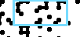

# primewords


`primewords` renders prime numbers as dot graphs and experiments with finding
word-like patterns inside those graphs. Numbers are laid out row by row; prime
numbers become bright dots, and OCR/template-search tools can scan the resulting
image for readable shapes.

## Example

The included crop below is `car-2451-15.png`: Tesseract read `car` in a prime
graph with width `2451` and chart height `15`.



Found-word crops use this filename pattern:

```text
<word>-<graph-width>-<chart-height>.png
```

## Project Layout

- `src/primewords/primes.py` contains the reusable package code for rendering
  prime-dot PNGs and ranking straight-line prime runs.
- `Examples/Primes/generate_img.py` creates a small prime graph image.
- `Examples/Primes/analyse_line_length.py` ranks graph widths by the longest
  contiguous prime lines.
- `Examples/Primes/generate_img_analyse_chars.py` runs the OCR and template
  matching experiments.
- `Examples/Primes/word_search_cache/found/` contains saved OCR word crops.

## Setup With uv

This project is configured as a `uv` package project and pins local development
to Python 3.13 with `.python-version`. From the repository root:

```bash
uv sync --python 3.13
```

That creates a Python 3.13 virtual environment and installs the dependencies
declared in `pyproject.toml`:

- `numpy`
- `opencv-python`
- `pandas`
- `pillow`

Run a quick package smoke test:

```bash
uv run python -c "from primewords import estimate_png_dimensions; print(estimate_png_dimensions(30, 100))"
```

Generate the small example prime graph:

```bash
uv run python Examples/Primes/generate_img.py
```

## Tesseract Requirement

Tesseract is required for OCR word scans. It is not a Python package, so `uv`
cannot install it from `pyproject.toml`; install the `tesseract` executable with
your operating system package manager and make sure it is on `PATH`.

macOS:

```bash
brew install tesseract
```

Ubuntu/Debian:

```bash
sudo apt-get install tesseract-ocr
```

Verify it is available:

```bash
tesseract --version
```

In prose, the clearest way to say it is:

> OCR features require the Tesseract executable as a system dependency. `uv`
> installs the Python packages, but Tesseract must be installed separately and
> available on `PATH`.

Prime graph rendering and line analysis do not need Tesseract; only OCR scans
do.

## OCR Search Example

To run a focused scan around the included `car-2451-15` example:

```bash
uv run python Examples/Primes/generate_img_analyse_chars.py \
    --word car \
    --width-start 2400 \
    --max-number 36765 \
    --chart-height 15 \
    --workers 4
```

The OCR script writes scan output to:

- `Examples/Primes/prime_ocr_width_scan.csv`
- `Examples/Primes/prime_ocr_width_scan.jsonl`
- `Examples/Primes/word_search_cache/`

Use `--square-dots` when you want multi-pixel prime cells rendered as filled
squares instead of round dots.

## API Example

```python
from primewords import generate_prime_dot_png, rank_widths_by_prime_lines

metadata = generate_prime_dot_png(
    width=30,
    max_number=100,
    output_path="Examples/Primes/primes.png",
    cell_size=1,
)
print(metadata)

best_lines = rank_widths_by_prime_lines(
    range(2, 100),
    max_number=100_000,
    min_length=5,
    workers=1,
)
print(best_lines[:5])
```
