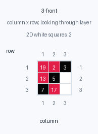
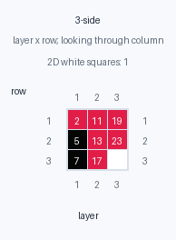
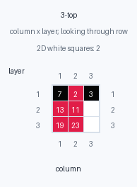
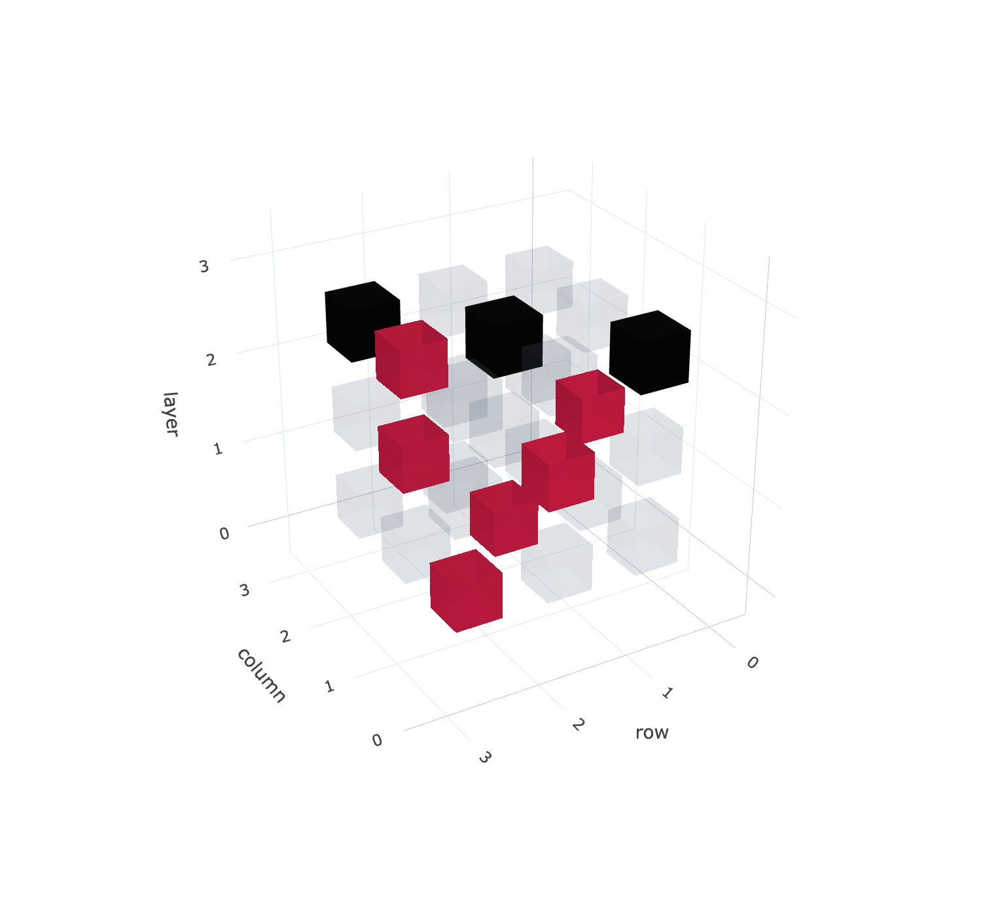

# primestuff

I was looking at [Visualization of Prime Numbers](https://www.dandad.org/annual/2024/entry/professional/238106) and had a thought.

If you graph the primes in 3d cubes like:

```py
[
    [
        [1,2,3],    # 2, 3
        [4,5,6],    # 5
        [7,8,9]     # 7
    ],
    [
        [10,11,12], # 11
        [13,14,15], # 13
        [16,17,18]  # 17
    ],
    [
        [19,20,21], # 19
        [22,23,24], # 23
        [25,26,27]  # -
    ]
]
```

Projected onto a 2D surface and considering only the primes, this looks like.

```py
# Front
[
    [19,2,3],
    [13,5,-],
    [7,17,-]
]


# Side
[
    [2,11,19],
    [5,13,23],
    [7,17,-]
]


# Top
[
    [7,2,3],
    [13,11,-],
    [19,23,-]
]

# The series of primes in the side view are:
2, 5, 7, 11, 13, 17, 19, 23
```

The longest line of primes in any direction within this graph is length 3 - `[3, 5, 7]`.

This corresponds to:







The question becomes, **what is the smallest number for which you get no `-` viewed from the sides or top of the cube.**

Ie. which cube is completely filled with numbers when looking from the front, side or top.

The answer is 67 - 67x67x67. The largest prime in this series is 300,719. This is not the largest prime in the cube - but from the view of the side.

I'm a recreational mathematician, so I asked Gemini if it's anything new- _"the underlying mathematics is entirely covered by existing number theory. If you brought this to a number theorist, they wouldn’t say you discovered a new theorem, but they would likely say, "That is a really cool visual metaphor to teach prime gaps...You haven't discovered new math, but you have invented a fantastic visualization tool."_

It might be flattering me. I didn't have my trusty 'Don't waffle, Don't be sycophantic' system prompt in.

But I'd be crazy not to hop on the end of the 67 meme. So here is primestuff.

See [67-top.png](assets/cube_side_snapshots_examples/67-top.png)

`primestuff` renders prime numbers as dot graphs and visualises their structure
in 2D grids, interactive 3D cubes, side snapshots, and straight-line prime-run
analysis. Numbers are laid out row by row; prime numbers become bright dots, and
non-primes remain dark.

## Example

Generate a small prime graph image:

```bash
uv run python Examples/Primes/generate_img.py
```

That writes `Examples/Primes/primes.png`.

## Project Layout

- `src/primestuff/primes.py` contains the reusable package code for rendering
  prime-dot PNGs, generating interactive 3D prime cubes, and ranking
  straight-line prime runs.
- `Examples/Primes/generate_img.py` creates a small prime graph image.
- `Examples/Primes/generate_3d_cube.py` creates a Plotly-powered 3D prime cube.
- `Examples/Primes/generate_3d_cube_side_snapshots.py` renders orthographic PNG
  snapshots of prime cubes.
- `Examples/Primes/nD_search/search_nd_projection.py` searches 3D, 4D, 5D,
  and higher-dimensional hypercubes for prime projections with no empty cells.
- `Examples/Primes/analyse_line_length.py` ranks graph widths by the longest
  contiguous prime lines.
- `Examples/Primes/search_zero_white_box.py` searches cube dimensions for
  projections with no empty cells.

## Setup With uv

This project is configured as a `uv` package project and pins local development
to Python 3.13 with `.python-version`. From the repository root:

```bash
uv sync --python 3.13
```

That creates a Python 3.13 virtual environment and installs the dependencies
declared in `pyproject.toml`:

- `numpy`
- `pandas`
- `pillow`

Run a quick package smoke test:

```bash
uv run python -c "from primestuff import estimate_png_dimensions; print(estimate_png_dimensions(30, 100))"
```

Generate the small example prime graph:

```bash
uv run python Examples/Primes/generate_img.py
```

Generate an interactive 3D prime cube:

```bash
uv run python Examples/Primes/generate_3d_cube.py
```

That writes `Examples/Primes/primes_3d_cube.html`, a standalone Plotly scene
with controls for prime opacity, non-prime opacity, marker size, labels, grid
visibility, and camera reset. The default cube is `3 x 3 x 3`: `1` sits above
`10` and `19`, `2` sits above `11` and `20`, and `9` sits above `18` and `27`.
The HTML loads Plotly.js from the CDN, so no extra Python dependency is needed.

Use `--square-dots` when you want multi-pixel prime cells rendered as filled
squares instead of round dots.

Search for the higher-dimensional equivalent of the 3D side length `67`:

```bash
uv run python Examples/Primes/nD_search/search_nd_projection.py --dimensions 4 5 --max-side 250
```

By default this looks for the first side length where any orthographic
projection axis has no empty cells, matching the 3D `67` result. Add
`--mode all` to require every projection axis to be full.

Current 4D result with the default `any` projection mode:

```bash
uv run python Examples/Primes/nD_search/search_nd_projection.py --dimensions 4 --max-side 1000 --progress 0 --method auto
```

```text
searching 4D: sides 3..1000, mode=any, method=auto
  found 4D side 295 using line: full projection axis/axes: axis 3
  max number in hypercube: 7,573,350,625
  largest prime in side-on PNG/projection: 7,573,350
```

## API Example

```python
from primestuff import (
  generate_prime_cube_plot_html,
  generate_prime_dot_png,
  rank_widths_by_prime_lines,
)

metadata = generate_prime_dot_png(
    width=30,
    max_number=100,
    output_path="Examples/Primes/primes.png",
    cell_size=1,
)
print(metadata)

best_lines = rank_widths_by_prime_lines(
    range(2, 100),
    max_number=100_000,
    min_length=5,
    workers=1,
)
print(best_lines[:5])

cube = generate_prime_cube_plot_html(
  output_path="Examples/Primes/primes_3d_cube.html",
  plane_width=3,
  plane_height=3,
  layers=3,
)
print(cube)
```
